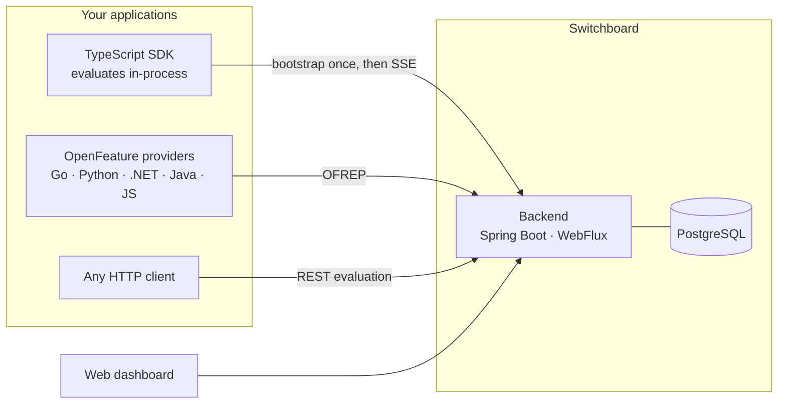

<picture>
  <source media="(prefers-color-scheme: dark)" srcset="docs/assets/logo-dark.svg">
  
</picture>

Feature flags with an AI layer that heals and optimizes rollouts on its own.

You ship a flag at 10%. Switchboard watches the metrics coming back per variant. If the new
variant starts erroring, it rolls back — before you wake up. If it converts better, it drafts
the next ramp step. Every AI change goes through the same versioned, audited write path a
human edit does, so nothing happens that you cannot see or undo.



Every surface speaks to the same REST API, so nothing can do something another cannot.
Changes propagate through Postgres `NOTIFY`, which means a second backend instance learns
about a flag change the same way the first one does — there is no Redis or message broker
in the picture.

## Quick start

```bash
make deps-up     # postgres 18 + firebase auth emulator
make backend     # spring boot on :28080 (local profile: dev tokens on)
make seed        # demo workspace, driven through the public API
make dashboard   # web dashboard on :5273  <- the main UI
```

Seed logins are `alice@switchboard.dev` (owner), `bob@switchboard.dev` (member),
`carol@beta.dev` (a second org, proving isolation) — password `password123`.
The seed prints one SDK key per environment; they are shown once and stored hashed.

Then evaluate a flag — no client library required, it is one POST:

```js
const res = await fetch('http://localhost:28080/api/eval/new-checkout', {
  method: 'POST',
  headers: { Authorization: `Bearer ${SDK_KEY}`, 'Content-Type': 'application/json' },
  body: JSON.stringify({
    context: { key: userId, attributes: { plan: 'pro', platform: 'ios' } },
    default: 'false',            // served back if the flag is unknown — always safe
  }),
});
const { value, reason } = await res.json();   // e.g. { value: "true", reason: "ROLLOUT" }
```

## Documentation

| | |
|---|---|
| [Architecture](docs/architecture.md) | The model, the write path, evaluation precedence, bucketing, and the two contracts that are enforced rather than described |
| [Integrating](docs/integrating.md) | Evaluating from your code, OpenFeature/OFREP, reporting outcomes, gating AI agents |
| [Targeting](docs/targeting.md) | Rules, segments, and the two limits worth knowing before you design around them |
| [Governance](docs/governance.md) | Scoped RBAC, approvals, and the two places review is deliberately skipped |
| [The AI layer](docs/ai-layer.md) | Healing, optimizing, and the statistics underneath — including why the scan interval does not affect the error rate |
| [Development](docs/development.md) | Layout, running each piece, and how to verify a change |

Reference: [DECISIONS.md](docs/DECISIONS.md) records the choices that look wrong until you know why —
read it before "fixing" something that seems obviously broken.
[REMAINING-WORK.md](docs/REMAINING-WORK.md) is what is left to build.
[competitive-gaps.md](docs/competitive-gaps.md) is the market research the backlog derives from.

Working on this with an agent? [`CLAUDE.md`](CLAUDE.md) has the commands, conventions and
environment traps.

## What it does

**Flags are per-project; behaviour is per-environment.** The same `new-checkout` flag can be
fully on in dev, at 25% in production, and killed in staging.

**Every write is versioned, audited and reversible.** One transaction bumps a monotonic version,
appends an immutable snapshot, writes an audit row and advances the environment's change cursor.
Rollback writes a *new* version rather than rewinding, so history is never rewritten and a rollback
is itself rollback-able.

**An unknown flag is not an error.** It returns the default the caller passed in, at HTTP 200. A
flag system that can take your application down when it does not recognise a key is worse than no
flag system.

**The AI layer is a closed circuit.** Your application reports outcomes, a scan judges them with an
anytime-valid sequential test, and the result is an ordinary flag change. The scan is safe to run as
often as you like — that is a property of the statistic, not a hope. See
[the AI layer](docs/ai-layer.md).

**Gating an AI agent is the same primitive.** Use the run id as the context key, put the agent name
and version in attributes, and a prompt revision becomes a multivariate flag that the monitor can
roll back or ramp on its own.

## Verifying

```bash
make test    # unit + integration (Testcontainers), including the concurrency race tests
make smoke   # ~35 API cases end to end, negative paths included
make check   # compile + checkstyle
```

`make smoke` is the fastest honest answer to "is it working". Six live-check scripts against a
running stack are the real regression net — see [Development](docs/development.md#the-live-checks).
