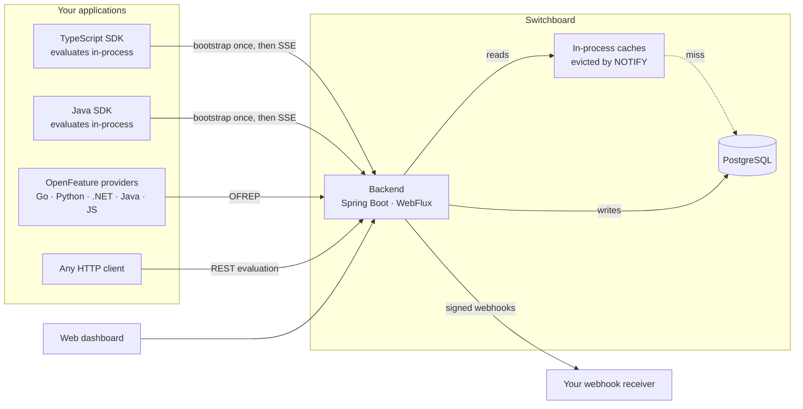

<picture>
  <source media="(prefers-color-scheme: dark)" srcset="docs/assets/logo-dark.svg">
  
</picture>

Feature flags with an AI layer that heals and optimizes rollouts on its own.

You ship a flag at 10%. Switchboard watches the metrics coming back per variant. If the new
variant starts erroring, it rolls back — before you wake up. If it converts better, it drafts
the next ramp step. Every AI change goes through the same versioned, audited write path a
human edit does, so nothing happens that you cannot see or undo.



Every surface speaks to the same REST API, so nothing can do something another cannot.
Changes propagate through Postgres `NOTIFY`, which means a second backend instance learns
about a flag change the same way the first one does — there is no Redis or message broker
in the picture.

**That same channel is what makes the caches safe.** Reads are served from in-process caches
and a write evicts them everywhere, so the TTLs are a backstop against a dropped notification
rather than a budget for how stale an answer may be. A shared cache would add a network hop to
the hottest read in the product and buy nothing — which is why there is still no Redis here.
The one thing that would genuinely want one is the rate limiter, and only above a single
instance; [DEPLOYMENT.md](docs/DEPLOYMENT.md#scaling-past-one-node) says so in order.

**The Java SDK and the server run the same evaluator.** Bucketing, the operators, semver and
precedence live in one JDK-only module both compile against, so there is no second
implementation to drift from the first. Java appears twice above on purpose: OFREP gives you a
provider for free and evaluates remotely, while the native SDK evaluates in-process — no I/O per
flag check, and it keeps working through a Switchboard outage.
[`sdk/java/README.md`](sdk/java/README.md) says which to pick.

## Quick start

```bash
make deps-up     # postgres 18 + firebase auth emulator
make backend     # spring boot on :28080 (local profile: dev tokens on)
make seed        # demo workspace, driven through the public API
make dashboard   # web dashboard on :5273  <- the main UI
```

Seed logins are `alice@switchboard.dev` (owner), `bob@switchboard.dev` (member),
`carol@beta.dev` (a second org, proving isolation) — password `password123`.
The seed prints one SDK key per environment; they are shown once and stored hashed.

Then evaluate a flag — no client library required, it is one POST:

```js
const res = await fetch('http://localhost:28080/api/eval/new-checkout', {
  method: 'POST',
  headers: { Authorization: `Bearer ${SDK_KEY}`, 'Content-Type': 'application/json' },
  body: JSON.stringify({
    context: { key: userId, attributes: { plan: 'pro', platform: 'ios' } },
    default: 'false',            // served back if the flag is unknown — always safe
  }),
});
const { value, reason } = await res.json();   // e.g. { value: "true", reason: "ROLLOUT" }
```

## Documentation

| | |
|---|---|
| [Architecture](docs/architecture.md) | The model, the write path, evaluation precedence, bucketing, and the two contracts that are enforced rather than described |
| [Integrating](docs/integrating.md) | Evaluating from your code, OpenFeature/OFREP, reporting outcomes, gating AI agents |
| [Targeting](docs/targeting.md) | Rules, segments, and the two limits worth knowing before you design around them |
| [Governance](docs/governance.md) | Scoped RBAC, approvals, and the two places review is deliberately skipped |
| [The AI layer](docs/ai-layer.md) | Healing, optimizing, and the statistics underneath — including why the scan interval does not affect the error rate |
| [Development](docs/development.md) | Layout, running each piece, and how to verify a change |
| [Deployment](docs/DEPLOYMENT.md) | Containers, configuration, migrations, retention, and the honest answer about when Redis becomes necessary |
| [Performance](docs/PERFORMANCE.md) | Measured p50/p95/p99, the rig, and the instrument's own error — written to be falsifiable rather than quoted |

Reference: [DECISIONS.md](docs/DECISIONS.md) records the choices that look wrong until you know why —
read it before "fixing" something that seems obviously broken.
[REMAINING-WORK.md](docs/REMAINING-WORK.md) is what is left to build.
[competitive-gaps.md](docs/competitive-gaps.md) is the market research the backlog derives from.

Working on this with an agent? [`CLAUDE.md`](CLAUDE.md) has the commands, conventions and
environment traps.

## What it does

**Flags are per-project; behaviour is per-environment.** The same `new-checkout` flag can be
fully on in dev, at 25% in production, and killed in staging.

**Every write is versioned, audited and reversible.** One transaction bumps a monotonic version,
appends an immutable snapshot, writes an audit row and advances the environment's change cursor.
Rollback writes a *new* version rather than rewinding, so history is never rewritten and a rollback
is itself rollback-able.

**An unknown flag is not an error.** It returns the default the caller passed in, at HTTP 200. A
flag system that can take your application down when it does not recognise a key is worse than no
flag system.

**The AI layer is a closed circuit.** Your application reports outcomes, a scan judges them with an
anytime-valid sequential test, and the result is an ordinary flag change. The scan is safe to run as
often as you like — that is a property of the statistic, not a hope. See
[the AI layer](docs/ai-layer.md).

**Reads are fast because they are cached, and correct because eviction is exact.** Evaluation,
the bootstrap payload, SDK-key resolution, permissions and the dashboard's flag list are all
served from memory; every write that could change one clears it across every instance. Measured,
not asserted: sub-millisecond at p50 on every cache-served path, and the flag list went from a
p99 of 73.8 ms to about 5 ms when it joined them. [PERFORMANCE.md](docs/PERFORMANCE.md) states
the rig and the caveats, including where the numbers stop being trustworthy.

**Changes can leave the building.** Signed webhooks (HMAC-SHA256, filtered by event type,
project or environment, retried with backoff) carry flag updates, kill switches, rollbacks and
monitor findings to whatever you point them at. Audit exports stream as NDJSON or CSV.

**Gating an AI agent is the same primitive.** Use the run id as the context key, put the agent name
and version in attributes, and a prompt revision becomes a multivariate flag that the monitor can
roll back or ramp on its own.

## Verifying

```bash
make test    # unit + integration (Testcontainers), including the concurrency race tests
             # runs from the repo root: evaluation/ and backend/ are one reactor build
make smoke   # 51 API cases end to end, negative paths included
make check   # compile + checkstyle
```

`make smoke` is the fastest honest answer to "is it working". Seven live-check scripts against a
running stack are the real regression net — see [Development](docs/development.md#the-live-checks) —
plus the Java SDK's, which is a JUnit test rather than a script because driving a JVM SDK from
node would prove nothing about the JVM SDK. It asserts the SDK's in-process answers equal the
server's for the same flags and contexts, and it is what caught the SDK rejecting every real
bootstrap payload over a wire-format detail no hand-written fixture contained.

All of it runs in [CI](.github/workflows/ci.yml) on every pull request, the live checks included:
they bring up a real stack, seed it, and run all seven. Contract drift is exactly what unit tests
miss, so it is the one thing a merge should not be able to get past.

## Deploying

```bash
cp .env.prod.example .env       # then set POSTGRES_PASSWORD; it has no default on purpose
docker compose -f docker-compose.prod.yml up --build -d --wait
```

Postgres, the backend and the dashboard. The backend migrates the schema on boot, so the first
`up` on an empty volume is a working install. One built dashboard image serves any environment —
configuration is written into the page at container start rather than baked into the bundle.
[DEPLOYMENT.md](docs/DEPLOYMENT.md) has the rest, including what must never carry over from a
laptop.
