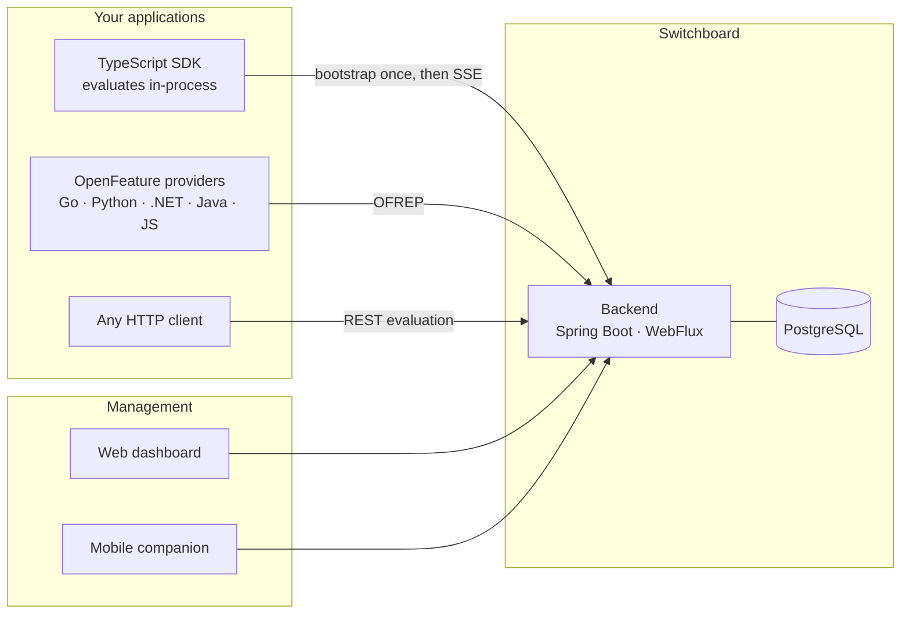
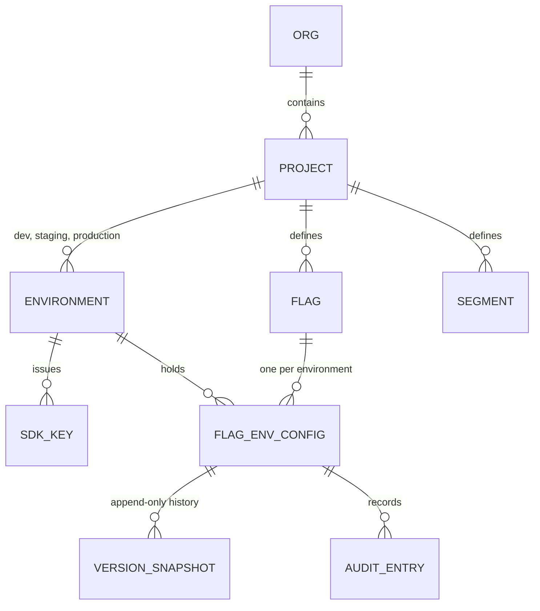
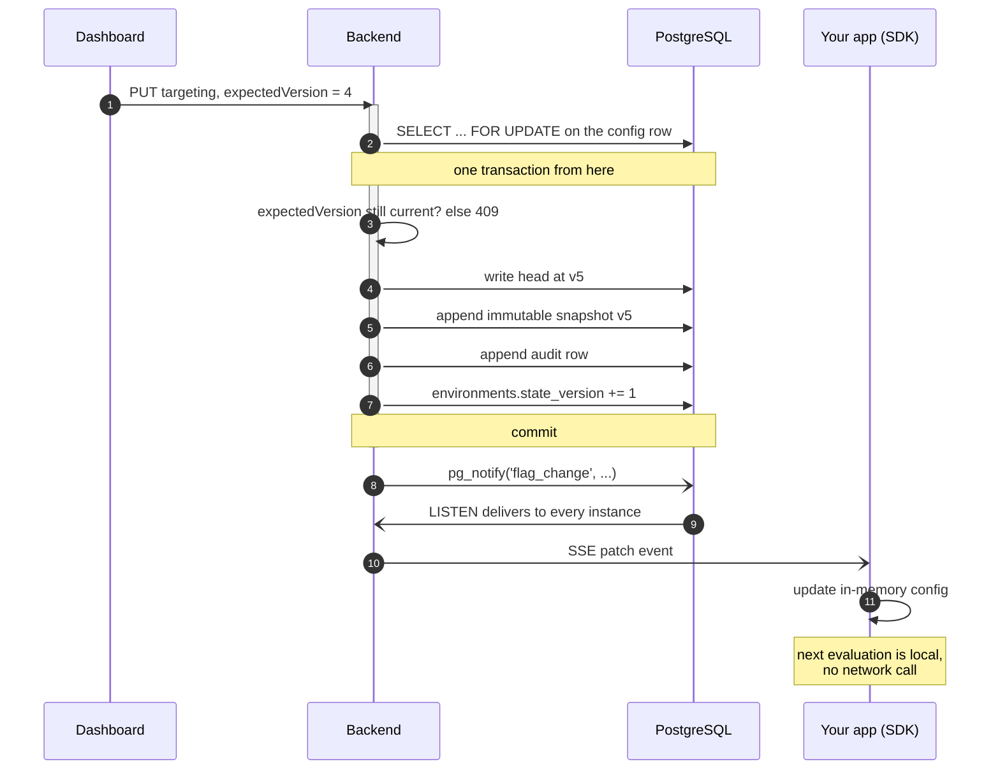
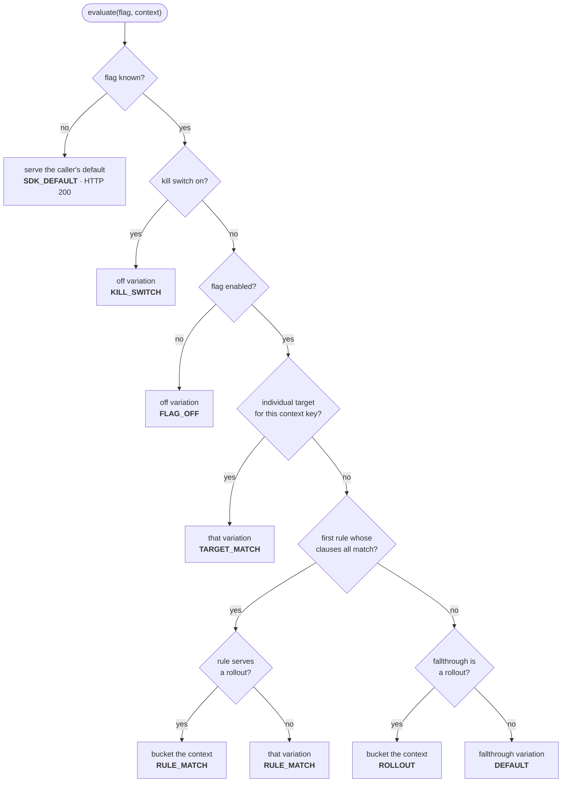
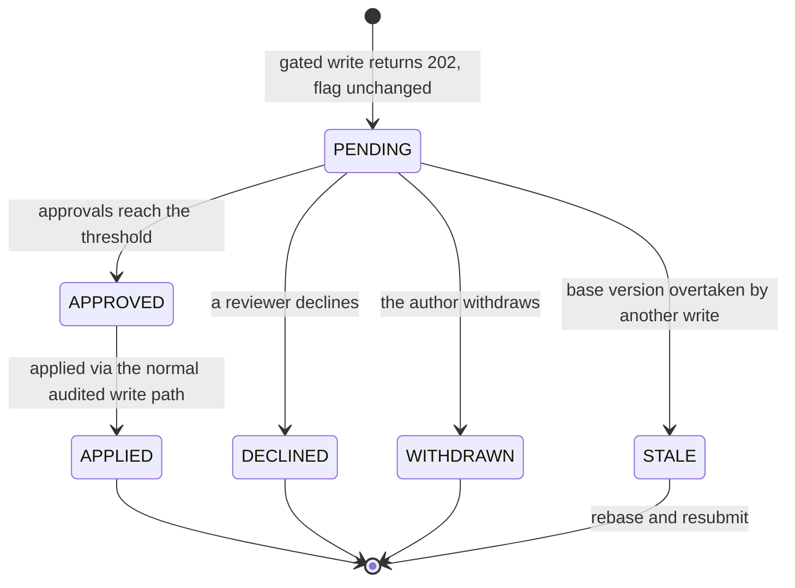
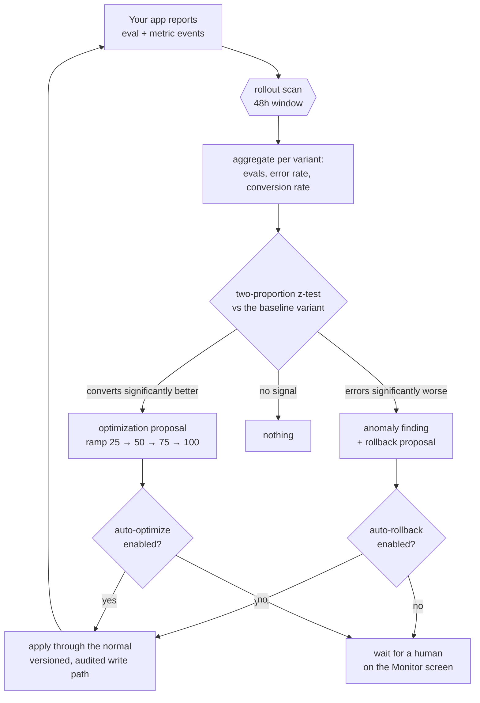

# Switchboard

Feature flags with an AI layer that heals and optimizes rollouts on its own.

You ship a flag at 10%. Switchboard watches the metrics coming back per variant. If the new
variant starts erroring, it rolls back — before you wake up. If it converts better, it drafts
the next ramp step. Every AI change goes through the same versioned, audited write path a
human edit does, so nothing happens that you cannot see or undo.

The management UI is a web dashboard. There is also an iOS/Android companion app, so the
kill switch is in your pocket when you are not at a desk.



Every surface speaks to the same REST API, so nothing can do something another cannot.
Changes propagate through Postgres `NOTIFY`, which means a second backend instance learns
about a flag change the same way the first one does — there is no Redis or message broker
in the picture.

## Quick start

```bash
make deps-up     # postgres 18 + firebase auth emulator
make backend     # spring boot on :28080 (local profile: dev tokens on)
make seed        # demo workspace, driven through the public API
make dashboard   # web dashboard on :5273  <- the main UI
make app         # expo dev client (optional mobile companion)
```

Seed logins are `alice@switchboard.dev` (owner), `bob@switchboard.dev` (member),
`carol@beta.dev` (a second org, proving isolation) — password `password123`.
The seed prints one SDK key per environment; they are shown once and stored hashed.

Local ports: backend **28080**, dashboard **5273**, postgres **25432**, auth emulator
**29099**, Metro **8092**.

## The model



A **flag** is defined once per project — its key, whether it is boolean or multivariate,
and its variations. How it behaves is per **environment**: the same `new-checkout` flag can
be fully on in dev, at 25% in production, and killed in staging, because each environment
holds its own config.

`FlagEnvConfig` is the unit of change. Every write bumps a strictly monotonic version,
appends an immutable snapshot, writes an audit row, and advances the environment's
`stateVersion` — all in one transaction. Rollback writes a *new* version that copies an old
snapshot; history is never rewritten.

Here is what actually happens between someone moving a slider and a running application
serving the new value:



The row lock is what makes concurrent edits safe: twenty simultaneous writers produce
versions 1 through 20 with no gaps and no lost updates, which is asserted by a race test.
`expectedVersion` is how a stale editor gets a 409 instead of silently clobbering someone
else's change.

### Evaluation precedence

Every evaluation walks the same ladder, stopping at the first thing that matches. The
reason it stopped comes back with the answer, which is what makes "why did this user get
that?" answerable.



An unknown or archived flag is deliberately **not** an error: it returns the default the
caller passed in, at HTTP 200. A flag system that can take your application down when it
does not recognise a key is worse than no flag system.

Bucketing is `int(hex(md5(flagKey + ":" + contextKey))[0:8], 16) % 10000`, walked
cumulatively across the rollout weights (each whole-percent weight covers 100 buckets). MD5 is
chosen for ubiquity, not security: every language an SDK could target has it in the standard
library, so a local evaluation agrees with the server byte for byte. Two consequences worth
knowing: a user who is in at 10% is still in at 25% (ramps are sticky, not a reshuffle), and
buckets are decorrelated across flags because the flag key salts the hash.

The algorithm, the precedence ladder and the clause semantics are specified in
[`spec/evaluation.md`](spec/evaluation.md), with machine-readable conformance vectors in
[`spec/conformance/`](spec/README.md) that the backend executes as part of its test suite.

## Using it from your code

Evaluate against an environment's SDK key. No client library required — it is one POST.

```js
const res = await fetch('http://localhost:28080/api/eval/new-checkout', {
  method: 'POST',
  headers: { Authorization: `Bearer ${SDK_KEY}`, 'Content-Type': 'application/json' },
  body: JSON.stringify({
    context: { key: userId, attributes: { plan: 'pro', platform: 'ios' } },
    default: 'false',            // served back if the flag is unknown — always safe
  }),
});
const { value, reason } = await res.json();   // e.g. { value: "true", reason: "ROLLOUT" }
```

### OpenFeature / OFREP

Switchboard implements [OFREP](https://github.com/open-feature/protocol), so the
OpenFeature-maintained providers for Go, Python, .NET, Java, and JavaScript work against it
with no Switchboard-specific code: `POST /ofrep/v1/evaluate/flags/{key}` and
`POST /ofrep/v1/evaluate/flags` (bulk, with ETag/304), authenticated by SDK key via either
`Authorization: Bearer` or `X-API-Key`. `GET /ofrep/v1/stream` pushes `refetchEvaluation`
events. For TypeScript, `sdk/typescript` is a first-party provider that evaluates locally.

`POST /api/eval` evaluates every flag at once for a context. `GET /api/eval/bootstrap`
returns the whole environment payload with an `ETag`; send `If-None-Match` and you get a 304
when nothing changed. For push updates, hold open `GET /api/stream` (SSE): a `put` on
connect, a `patch` per change, `ping` every 15s. Changes propagate through Postgres
`NOTIFY`, so every instance sees them without instance-to-instance coupling.

Report outcomes back so the AI layer has something to judge:

```js
await fetch('http://localhost:28080/api/events/metrics', {
  method: 'POST',
  headers: { Authorization: `Bearer ${SDK_KEY}`, 'Content-Type': 'application/json' },
  body: JSON.stringify({ events: [{ contextKey: userId, metricKey: 'error', value: 1,
                                    occurredAt: new Date().toISOString() }] }),
});
```

## Gating AI agents

Flag contexts carry arbitrary attributes, which makes an agent run a first-class subject.
Use the run id as the context key and describe the run in attributes:

```js
const { value: promptVariant } = await evaluate('agent-planner-prompt', {
  key: runId,
  attributes: { agent: 'meal-planner', version: 'v3', plan: 'pro' },
});
// promptVariant === 'prompt-v1' | 'prompt-v2'
```

Now a prompt revision, a tool, or an entire sub-behavior is a multivariate flag: split agent
traffic 50/50, report `error` and `conversion` events per run, and the rollout monitor
compares the variants for you — rolling back a prompt that starts failing and ramping one
that measurably does better. Because targeting reads attributes, you can scope an experiment
to one agent (`agent EQUALS meal-planner`) while everything else stays on the baseline.
The seeded `agent-planner-prompt` flag is a working example of exactly this.

## Targeting

Targeting reads the context your application supplies, so anything you know about a request
can drive a decision:

```js
{ context: { key: userId, attributes: { tenantId: "acme", plan: "pro", platform: "ios" } } }
```

**Turning a feature on for exactly one customer** is a single rule — `tenantId EQUALS acme`
serves `true`, everyone else falls through to `false`. Reusable cohorts work the same way:
put tenant ids in a segment and target `SEGMENT_MATCH`, so one pilot-customer list drives
many flags. All of it is versioned, audited, and revocable per customer by kill switch.

Two limits worth knowing before you design around them. Rollout bucketing keys off
`context.key`, so a percentage rollout splits by whatever you pass as the key — usually the
user. "Roll out to 10% of *customers*" needs a `bucketBy` attribute, which is on the
backlog; today you would pass the tenant id as the context key and give up per-user
targeting on that flag. And attributes are strings compared by six operators, so
`version >= 4.2.0` is not expressible yet. Both are tracked in
[docs/REMAINING-WORK.md](docs/REMAINING-WORK.md).

## Governance

Roles are scoped and permissions are a **union** across org, project, and environment — a
narrow grant adds capability, it never strips what someone already had. Built-in roles
(OWNER, ADMIN, MAINTAINER, WRITER, APPROVER, VIEWER) are rows rather than code, so adding
one is an INSERT.

An environment can require approval. When it does, a write does not change the flag: it
returns **202** with a change request that needs review. Approvals apply through the same
versioned, audited write path a direct edit takes, so an approved change is rollback-able
like any other. A request whose base version was overtaken goes STALE rather than clobbering
the newer config.



Two deliberate exceptions, both configurable and both fully audited: the **kill switch
bypasses review** by default, because putting an emergency stop behind a queue turns an
incident into an outage; and **automated healing** keeps its bypass, because a rollback that
waits for a human during an error spike is not healing.

## The AI layer

Three functions, each backed by a domain port so providers swap, each degrading gracefully
when no API key is configured (the whole product works without one; AI endpoints return
`503 AI_UNAVAILABLE`).

- **Natural-language flag ops** — "release the new planner to 10% of iOS users on Pro" comes
  back as a typed diff you review before applying. The model is forced through a single
  tool schema, so the output is a validated change proposal, never free text applied blind.
- **Healing** — a scan compares per-variant error rates in the rollout window, screens with
  a two-proportion z-test, and files an anomaly finding. With auto-rollback enabled it
  applies the rollback itself and marks the finding `AUTO_ROLLED_BACK`.
- **Optimizing** — the same scan spots a variant that converts significantly better and
  drafts the next ramp step (25 → 50 → 75 → 100). Auto-apply is a separate opt-in.

The healing and optimizing loop is a closed circuit: your application reports outcomes, the
scan judges them, and the result is an ordinary flag change.



Both auto behaviors are per-org settings, off by default, and every application lands as an
ordinary audited version you can roll back. Scans run from `POST /api/jobs/rollout-scan` and
`/api/jobs/stale-flag-scan` (shared-secret header) so a scheduler drives them; an hourly
in-process job is only a backstop.

Stale flags get swept too: anything parked at 100% or 0% past the org's threshold earns a
retirement proposal with a generated removal checklist.

## Layout

A monorepo. Everything below is one git repo, brought up together by the root `Makefile`
and `docker-compose.yml`.

```
backend/    Spring Boot (WebFlux, R2DBC, Flyway) — DDD: domain / application / infrastructure / interfaces
dashboard/  Web UI — React + Vite (the primary management surface)
app/        Expo mobile companion (expo-router, TanStack Query, semantic design tokens)
            -- UNMAINTAINED since 2026-08-24, see docs/DECISIONS.md
sdk/        Client libraries — sdk/typescript is an OpenFeature provider with local evaluation
spec/       Normative evaluation spec + conformance vectors (the cross-language contract)
scripts/    seed-local.mjs · smoke-test.mjs · token.sh · resolve-java.sh
docs/       Competitive gap analysis and design notes
```

Each component carries its own README: [backend](backend/README.md),
[dashboard](dashboard/README.md), [app](app/README.md), [SDK](sdk/typescript/README.md),
[spec](spec/README.md).

Working on this? [`CLAUDE.md`](CLAUDE.md) has the commands, conventions and environment
traps; [`docs/REMAINING-WORK.md`](docs/REMAINING-WORK.md) is what is left to build.

**Two contracts, and both are enforced rather than described.** The OpenAPI document at
`backend/src/main/resources/openapi/switchboard-api.yaml` defines the wire: it generates the
server interfaces, and the clients mirror it. `spec/evaluation.md` defines evaluation
*behavior*, and `spec/conformance/` turns that into 201 machine-readable vectors that both
the Java server and the TypeScript SDK execute as tests — which is what keeps a flag from
evaluating one way on the server and another way in a client.

Every UI is a pure consumer of the same REST API, so no surface owns behavior another
cannot reach.

## Verifying

```bash
make test    # unit + integration (Testcontainers), including the concurrency race tests
make smoke   # ~35 API cases end to end, negative paths included
make check   # compile + checkstyle
```

`make smoke` is the fastest honest answer to "is it working". See TESTING.md for the manual
passes, including the kill-switch drill and the SSE watch.
