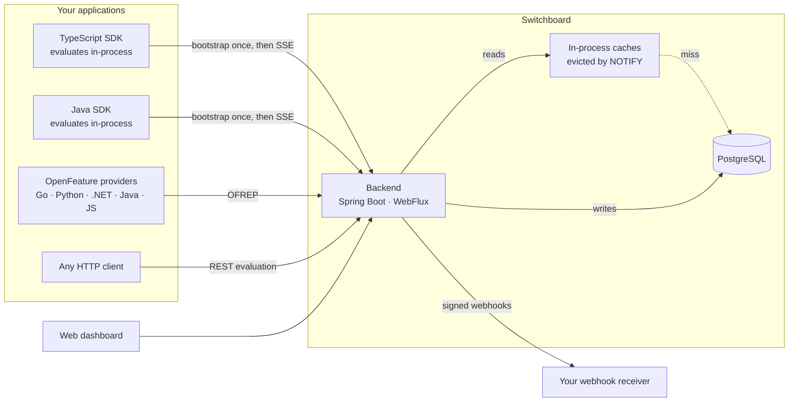

<picture>
  <source media="(prefers-color-scheme: dark)" srcset="docs/assets/logo-dark.svg">
  
</picture>

Feature flags with an AI layer that heals and optimizes rollouts on its own.

You ship a flag at 10%. Switchboard watches the metrics coming back per variant. If the new
variant starts erroring, it rolls back — before you wake up. If it converts better, it drafts
the next ramp step. Every AI change goes through the same versioned, audited write path a
human edit does, so nothing happens that you cannot see or undo.


```mermaid
flowchart LR
    subgraph apps["Your applications"]
        sdk["TypeScript SDK<br/>evaluates in-process"]
        jsdk["Java SDK<br/>evaluates in-process"]
        ofrep["OpenFeature providers<br/>Go · Python · .NET · Java · JS"]
        http["Any HTTP client"]
    end

    subgraph sb["Switchboard"]
        be["Backend<br/>Spring Boot · WebFlux"]
        cache["In-process caches<br/>evicted by NOTIFY"]
        db[("PostgreSQL")]
    end

    dash["Web dashboard"]
    hook["Your webhook receiver"]

    sdk -->|"bootstrap once, then SSE"| be
    jsdk -->|"bootstrap once, then SSE"| be
    ofrep -->|"OFREP"| be
    http -->|"REST evaluation"| be
    dash --> be
    be -->|"reads"| cache
    cache -.->|"miss"| db
    be -->|"writes"| db
    be -->|"signed webhooks"| hook
```

Every surface speaks to the same REST API, so nothing can do something another cannot, and
changes reach every backend instance through Postgres `NOTIFY`. Your
applications evaluate flags in-process with the Java or Node.js SDK, through any OpenFeature
provider over OFREP, or with one HTTP call.

## Get started

1. **Run it yourself** — the usual path for a company. [Self-hosting](docs/self-hosting.md) takes
   you from an empty server to your identity provider, your first admin and your team signed in,
   then hands over to getting started.
2. **Already have an instance?** Someone runs Switchboard for you, or you just finished
   self-hosting: [Getting started](docs/getting-started.md) goes from signing in to a flag rolling
   out in production with the AI layer watching it.
3. **Try it locally** — a demo workspace on your laptop, with seeded users and flags:

   ```bash
   make deps-up     # postgres 18 + firebase auth emulator (needs Docker)
   make backend     # the API on :28080 (needs JDK 25)
   make seed        # demo workspace; prints one SDK key per environment, once
   make dashboard   # the dashboard on http://localhost:5273
   ```

   Sign in as `alice@switchboard.dev` (owner), `bob@switchboard.dev` (member) or
   `carol@beta.dev` (a second org), password `password123`. This is a demo: the emulator, dev
   tokens and seed users must never reach a real deployment.
4. **See it first** — **[bryjshed.github.io/switchboard](https://bryjshed.github.io/switchboard/)**
   walks through every feature with real screens and simulations that run Switchboard's own
   algorithms. No stack needed. The page is [`demo/`](demo/), published by
   [`pages.yml`](.github/workflows/pages.yml); [`demo/README.md`](demo/README.md) covers presenting
   and regenerating it.

## Documentation

| | |
|---|---|
| [Self-hosting](docs/self-hosting.md) | Install, identity provider, first admin, inviting the team, building the SDKs |
| [Getting started](docs/getting-started.md) | Sign in → project → flag → SDK key → evaluate → roll out → approvals → AI |
| [Concepts](docs/concepts.md) | The vocabulary: orgs, environments, flags, rollouts, keys, roles, proposals |
| [Dashboard guide](docs/dashboard-guide.md) | Every page and settings tab, task by task |
| [Integrating](docs/integrating.md) | Java, Node.js, OFREP and REST; keys; the context; reporting outcomes; gating AI agents |
| [Targeting](docs/targeting.md) | Rules, operators, segments, and the one limit worth knowing |
| [Governance](docs/governance.md) | Invitations, roles and permissions, approvals, and the two places review is skipped |
| [The AI layer](docs/ai-layer.md) | Turning on healing and optimizing, and the statistics underneath |
| [Deployment](docs/DEPLOYMENT.md) | Operator reference: configuration, scheduled jobs, migrations, retention, backups, scaling |
| [Architecture](docs/architecture.md) | The model, the write path, evaluation precedence, bucketing |
| [Performance](docs/PERFORMANCE.md) | Measured p50/p95/p99, the rig, and the instrument's own error |

SDKs and tools: [Java SDK](sdk/java/README.md) · [TypeScript SDK](sdk/typescript/README.md) ·
[MCP server](mcp/README.md) · [Evaluation spec](spec/README.md).

## What it does

**Flags are per-project; behaviour is per-environment.** The same `new-checkout` flag can be
fully on in dev, at 25% in production, and killed in staging.

**Every write is versioned, audited and reversible.** One transaction bumps a monotonic version,
appends an immutable snapshot, writes an audit row and advances the environment's change cursor.
Rollback writes a *new* version rather than rewinding, so history is never rewritten and a rollback
is itself rollback-able.

**An unknown flag is not an error.** It returns the default the caller passed in, at HTTP 200. A
flag system that can take your application down when it does not recognise a key is worse than no
flag system.

**The AI layer is a closed circuit.** Your application reports outcomes, a scan judges them with an
anytime-valid sequential test, and the result is an ordinary flag change. The scan is safe to run as
often as you like — that is a property of the statistic, not a hope. See
[the AI layer](docs/ai-layer.md).

**Reads are fast because they are cached, and correct because eviction is exact.** Evaluation,
the bootstrap payload, SDK-key resolution, permissions and the dashboard's flag list are all
served from memory; every write that could change one clears it across every instance. Measured,
not asserted: sub-millisecond at p50 on every cache-served path, and the flag list went from a
p99 of 73.8 ms to about 5 ms when it joined them. [PERFORMANCE.md](docs/PERFORMANCE.md) states
the rig and the caveats, including where the numbers stop being trustworthy.

**Changes can leave the building.** Signed webhooks (HMAC-SHA256, filtered by event type,
project or environment, retried with backoff) carry flag updates, kill switches, rollbacks and
monitor findings to whatever you point them at. Audit exports stream as NDJSON or CSV.

**Gating an AI agent is the same primitive.** Use the run id as the context key, put the agent name
and version in attributes, and a prompt revision becomes a multivariate flag that the monitor can
roll back or ramp on its own.

## For contributors

- [Development](docs/development.md) — layout, running each piece, verifying a change, the live
  checks and CI.
- [DECISIONS.md](docs/DECISIONS.md) — the choices that look wrong until you know why. Read it
  before "fixing" something that seems obviously broken.
- [REMAINING-WORK.md](docs/REMAINING-WORK.md) — what is left to build, with effort and order.
- [competitive-gaps.md](docs/competitive-gaps.md) — the market research the backlog derives from.
- [TESTING.md](TESTING.md) — the manual passes automated tests cannot cover.
- Working with an agent? [`CLAUDE.md`](CLAUDE.md) has the commands, conventions and environment
  traps.

```bash
make test    # unit + integration, from the repo root
make smoke   # the API end to end against a running backend
make check   # compile + checkstyle
```
