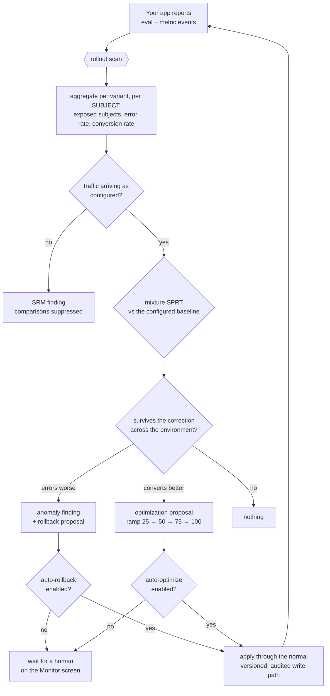

# The AI layer

Three functions, each backed by a domain port so providers swap, each degrading gracefully when no
API key is configured. The whole product works without one; AI endpoints return
`503 AI_UNAVAILABLE`, and the UI renders that as an explanation rather than an error.

- **Natural-language flag ops** — "release the new planner to 10% of iOS users on Pro" comes back as
  a typed diff you review before applying. The model is forced through a single tool schema, so the
  output is a validated change proposal, never free text applied blind.
- **Healing** — a scan compares per-variant error rates and files an anomaly finding. With
  auto-rollback enabled it applies the rollback itself and marks the finding `AUTO_ROLLED_BACK`.
- **Optimizing** — the same scan spots a variant that converts significantly better and drafts the
  next ramp step (25 → 50 → 75 → 100). Auto-apply is a separate opt-in.

Healing and optimizing work without any API key. Only the natural-language path needs one.

---

## The closed circuit

Your application reports outcomes, the scan judges them, and the result is an ordinary flag change.

Both auto behaviours are per-org settings, off by default, and every application lands as an ordinary
audited version you can roll back.

Scans run from `POST /api/jobs/rollout-scan` and `/api/jobs/stale-flag-scan` (shared-secret header)
so a scheduler drives them; an hourly in-process job is only a backstop.

## The statistics, and why they are what they are

This is the part the product leads with, so it is worth being precise about.

### Subjects, not events

Rates are computed over **distinct context keys**, not evaluation events. A server SDK evaluating a
flag in a hot loop emits hundreds of events for one user; dividing metric events by evaluation events
gives a ratio of event counts, not a proportion of anything. Handed to a test that assumes
independent trials it understates the variance by roughly the average evaluations-per-subject, and
inflates the statistic by roughly its square root.

No amount of statistical sophistication fixes a denominator that counts the wrong thing.

### An anytime-valid statistic, not a fixed-horizon one

The monitor runs on a schedule, so whatever it computes gets evaluated again and again. A
fixed-horizon test — a two-proportion z-test, say — is calibrated for **one** look. Re-running it
hourly and reacting to whichever look crosses the threshold inflates the false-positive rate without
bound: given enough looks, a rollout whose two arms are identical will eventually be rolled back.

Switchboard uses a mixture sequential probability ratio test, reported as an e-value. Under the null
that e-value is a non-negative supermartingale, so Ville's inequality bounds the probability that it
*ever* reaches 1/α by α — however often it is inspected, and even though the decision to stop depends
on the data.

**The observable consequence: the scan interval does not appear in any decision.** Set it to a minute
or to a day; the error guarantees are unchanged. That is precisely what was untrue before.

### Evidence accumulates from the allocation epoch

An anytime-valid guarantee rests on evidence that only grows. A rolling window is not that —
observations leave it, so the statistic resets its own information content on a timer, which is the
same pathology as restarting a fixed-horizon test forever.

So the evidence window runs from the **allocation epoch**: the last config write that changed how
traffic is split. Changing weights mid-flight resets the evidence, which is correct rather than
unfortunate — when the split changes, the arms contain different populations, and evidence gathered
across that boundary is testing a null that stopped existing.

A rollout that outruns the configured lookback has its window clipped, which weakens the guarantee
from "at most α forever" to "at most α per window". Findings record when that happened rather than
quietly assuming it away.

### The baseline comes from configuration

The control arm is the heaviest configured weight, and on an even split the flag's off variation —
never the arm that happens to have the most traffic. Choosing the baseline by observed volume makes
the control a function of the same noise being tested.

### Two gates before anything is believed

**Sample ratio mismatch.** If traffic did not arrive in the configured proportions, the randomizer is
broken — a bucketing bug, a sticky cache, an SDK ignoring weights, telemetry loss correlated with the
variant. The arms are then not comparable populations and every rate difference between them is
confounded. The gate suppresses all comparisons for that flag and raises a finding for a human;
there is nothing safe to automate about a broken randomizer. Only rollout-served traffic counts, so
adding a targeting rule does not trip it.

**Multiplicity.** One scan screens every challenger of every rolling-out flag in an environment, on
two metrics. Judging each against a single-hypothesis threshold means the busier the environment, the
more spurious rollbacks. Switchboard applies e-value Benjamini-Hochberg across the environment,
per direction — which controls the false discovery rate under *arbitrary* dependence, and these
hypotheses are certainly dependent: across flags they share metric-event rows, because a metric event
carries no flag key.

The two alphas are asymmetric on purpose. A false rollback reverts to a known-good baseline, is
audited, and is cheap to undo. A false ramp pushes a worse variant onto more traffic and locks in the
next rung of the ladder.

### What it does not promise

FDR control holds **per scan**. Per-hypothesis type-I error is controlled over all time. There is no
construction giving always-valid FDR across unboundedly many scans, and it would be easy — and wrong
— to imply otherwise.

## Configuration

Everything above is tunable under `switchboard.rollout-monitor` in `application.yml`: the two alphas,
the mixture scales, the subject floor, the lookback ceiling, the SRM gate and the metric keys.

One caution, and it is counter-intuitive: **the mixture scale τ must be set from what you consider
worth reacting to, never fitted to what the data is doing.** Validity does not depend on it — only
power does — and making it a function of the sample destroys the guarantee silently, while every
number on the screen still looks respectable.

## Stale flags

Swept too: anything parked at 100% or 0% past the org's threshold earns a retirement proposal with a
generated removal checklist.

The sweep can tell you a flag stopped making a decision, but not whether the code still calls it — a
code-references scanner would close that gap and is on the [backlog](REMAINING-WORK.md).
