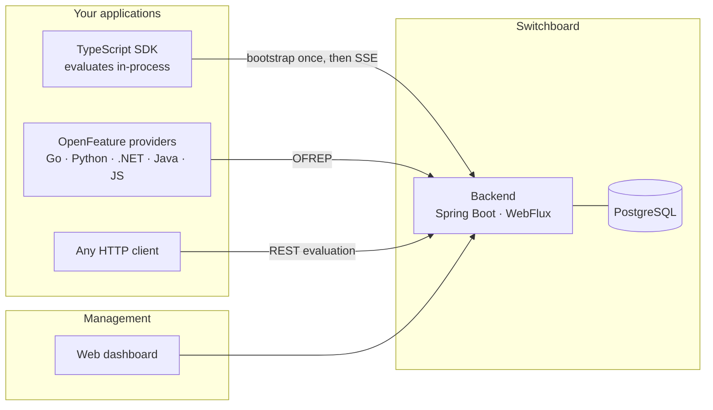
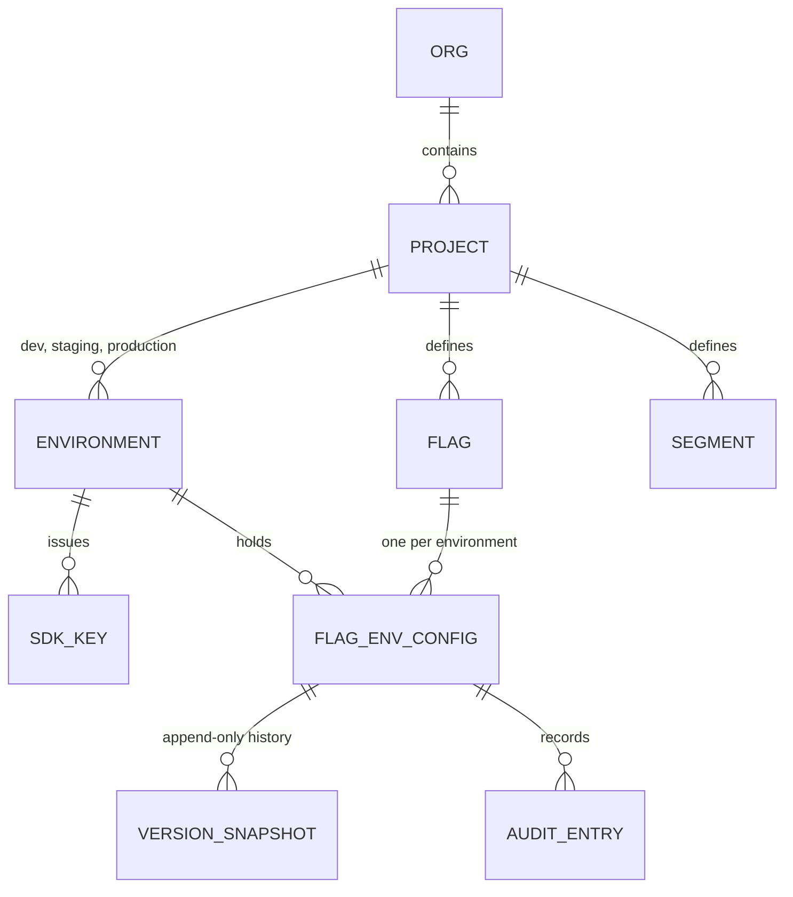
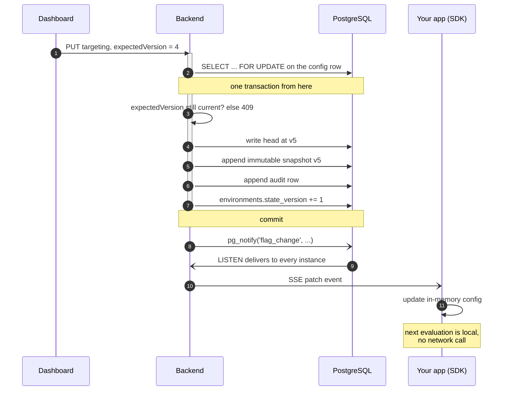
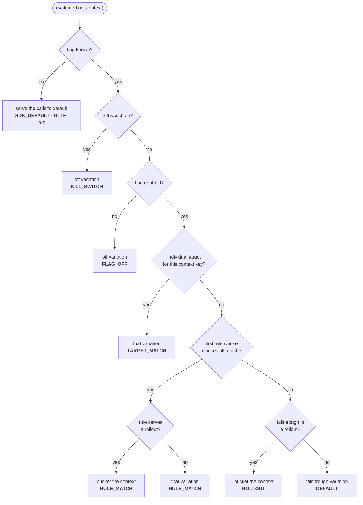

# Architecture

How Switchboard is put together, and why the pieces are shaped the way they are.

Companions: [integrating.md](integrating.md) for the client side, [governance.md](governance.md)
for approvals and RBAC, [ai-layer.md](ai-layer.md) for healing and optimizing.
[DECISIONS.md](DECISIONS.md) records the choices that look wrong until you know why — read it
before "fixing" something here that seems obviously broken.

---

## The shape of the system

Every surface speaks to the same REST API, so nothing can do something another cannot. Changes
propagate through Postgres `NOTIFY`, which means a second backend instance learns about a flag
change the same way the first one does — there is no Redis or message broker in the picture.

## The model

A **flag** is defined once per project — its key, whether it is boolean or multivariate, and its
variations. How it behaves is per **environment**: the same `new-checkout` flag can be fully on in
dev, at 25% in production, and killed in staging, because each environment holds its own config.

`FlagEnvConfig` is the unit of change. Every write bumps a strictly monotonic version, appends an
immutable snapshot, writes an audit row, and advances the environment's `stateVersion` — all in one
transaction. Rollback writes a *new* version that copies an old snapshot; history is never rewritten.

## The write path

Here is what actually happens between someone moving a slider and a running application serving the
new value:

The row lock is what makes concurrent edits safe: twenty simultaneous writers produce versions 1
through 20 with no gaps and no lost updates, which is asserted by a race test. `expectedVersion` is
how a stale editor gets a 409 instead of silently clobbering someone else's change.

**Every** flag mutation goes through this path — including AI-applied and approval-applied ones.
That is what makes "an automated rollback" and "someone moved a slider" the same kind of event, with
the same history and the same undo.

## Evaluation precedence

Every evaluation walks the same ladder, stopping at the first thing that matches. The reason it
stopped comes back with the answer, which is what makes "why did this user get that?" answerable.

An unknown or archived flag is deliberately **not** an error: it returns the default the caller
passed in, at HTTP 200. A flag system that can take your application down when it does not recognise
a key is worse than no flag system.

## Bucketing

`int(hex(md5(flagKey + ":" + contextKey))[0:8], 16) % 10000`, walked cumulatively across the rollout
weights — each whole-percent weight covers 100 buckets.

MD5 is chosen for ubiquity, not security: every language an SDK could target has it in the standard
library, so a local evaluation agrees with the server byte for byte. Two consequences worth knowing:
a user who is in at 10% is still in at 25% (ramps are sticky, not a reshuffle), and buckets are
decorrelated across flags because the flag key salts the hash.

## The two contracts, both enforced rather than described

**The wire.** `backend/src/main/resources/openapi/switchboard-api.yaml` generates the server
interfaces, and the clients mirror it. The dashboard's types are generated from the same document,
so a contract change that a page has not handled fails at compile time rather than at runtime.

**Evaluation behaviour.** [`spec/evaluation.md`](../spec/evaluation.md) specifies the precedence
ladder, the clause semantics and the bucketing algorithm, and
[`spec/conformance/`](../spec/README.md) turns that into machine-readable vectors that **both** the
Java server and the TypeScript SDK execute as tests. That shared execution is the only thing keeping
a flag from evaluating one way on the server and another way in a client.

Any change to evaluation behaviour lands as a spec edit **plus** updated vectors in the same commit.

## Delivery transport

REST bootstrap with ETag/304, plus SSE push, with polling demoted to an SDK fallback. This is where
the industry converged in 2026 rather than a local preference — the reasoning and the evidence are
in [DECISIONS.md](DECISIONS.md) and [design-review-2026-08-24.md](design-review-2026-08-24.md). Do
not "add gRPC for performance" or "simplify to polling" without reading those first; either move
would be a departure from the standard, not a catch-up.
