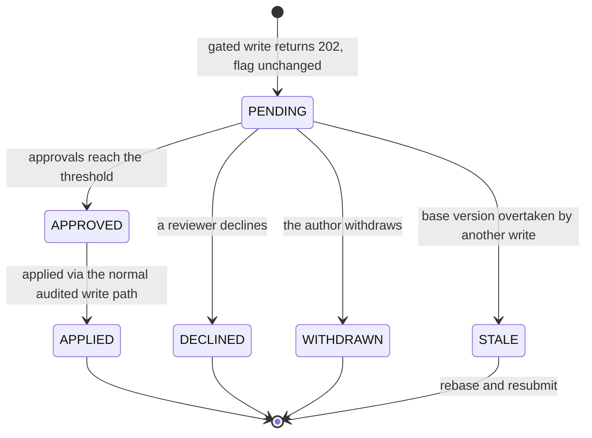

# Governance

Roles, approvals, and the two places review is deliberately skipped.

The reasoning behind each choice here is in [DECISIONS.md](DECISIONS.md) — several of them look
wrong until you know what they are avoiding.

---

## Roles and permissions

Roles are scoped and permissions are a **union** across org, project, and environment — a narrow
grant adds capability, it never strips what someone already had.

That is the opposite of most-specific-wins, and it is deliberate: under most-specific-wins, granting
someone APPROVER on production would silently *remove* the flag-write they already held org-wide.
The cost, accepted knowingly, is that permissions cannot be subtracted at a narrower scope — to take
capability away, lower the wider grant.

Containment runs one way only. An environment-scoped grant is authority inside that environment and
nowhere else; it does not roll up into project-wide read, or a VIEWER on dev could read production.

Built-in roles (OWNER, ADMIN, MAINTAINER, WRITER, APPROVER, VIEWER) are **rows rather than code**, so
adding one is an INSERT.

## Approvals

An environment can require approval. When it does, a write does not change the flag: it returns
**202** with a change request that needs review.

200 means a new config version exists; 202 means nothing was written and something is waiting. The
dashboard models that as a discriminated union so the type checker forces every call site to handle
the queued branch.

Approvals apply through the same versioned, audited write path a direct edit takes, so an approved
change is rollback-able like any other. A request whose base version was overtaken goes STALE rather
than clobbering the newer config — the same semantics as the `expectedVersion` 409 on direct writes.

Two details that exist to avoid a specific confusion:

- **Self-approval is refused with a 403**, not silently discounted. A reviewer told "recorded" whose
  approval does not move the counter has no way to tell that nothing happened.
- **`minApprovals` and `allowSelfApproval` are snapshotted onto each request.** Retuning policy
  mid-flight must not move the bar for something already under review.

## The two deliberate bypasses

Both configurable, both off-by-default in the sense that they can be turned off, and both fully
audited — additionally recorded as `APPROVAL_BYPASS` so "every write that skipped review" stays one
query.

**The kill switch bypasses review**, because putting an emergency stop behind a queue turns an
incident into an outage. This is what LaunchDarkly does, for the same reason.

**Automated healing keeps its bypass**, because a rollback that waits for a human during an error
spike is not healing. The action is inherently conservative — it reverts to a known-good baseline —
and an org that wants no unreviewed write path at all turns `allowAutomationBypass` off, after which
healing parks in the queue like everything else.
