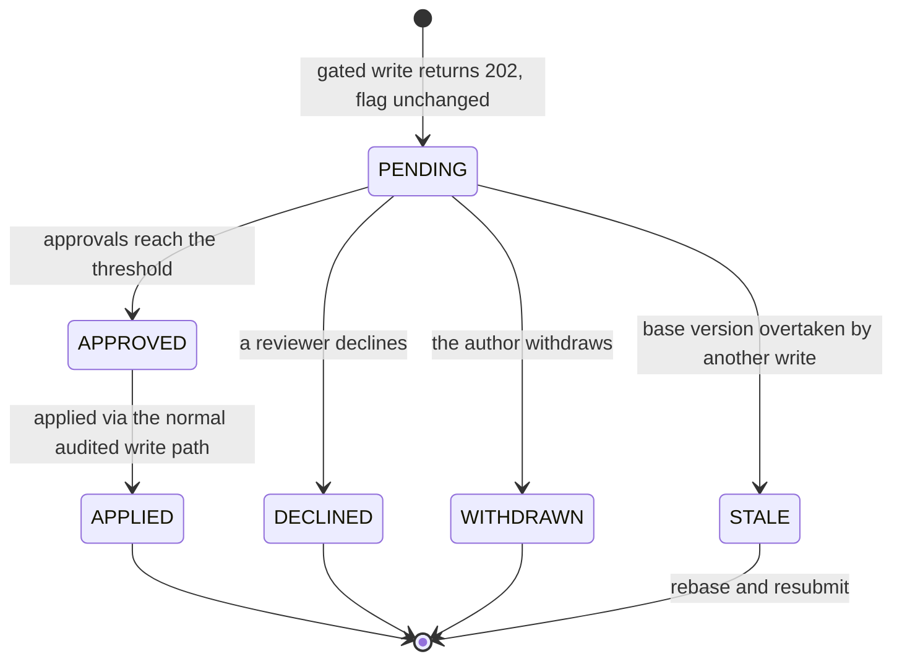

# Governance

Who can do what, how people join, how to put review in front of production, and the two places
review is deliberately skipped.

The reasoning behind each choice here is in [DECISIONS.md](DECISIONS.md) — several of them look
wrong until you know what they are avoiding.

---

## Inviting people

People join an organization by invitation.

1. **Settings → Organization.** Enter their email in the invite form, choose **Member** or
   **Owner**, and **Invite**. (The form appears only if you have *Manage people and roles*.)
2. Tell them the dashboard URL — **Switchboard sends no email.** **Copy sign-in link** on a
   pending invitation copies the instance's sign-in page for you.
3. What happens next depends on the address:
   - **It belongs to a verified account** — they are added immediately and the invitation comes
     back accepted.
   - **Otherwise** — the invitation is listed under **Pending invitations** and is accepted the
     first time that person signs in with the address *verified*. If they are already signed in
     and verify later, the dashboard's **I’ve verified — check again** (or any
     `GET /api/users/me` with a verified token) accepts it then.

**Revoke** withdraws a pending invitation. Inviting an existing member, or an address that
already has a pending invitation, is refused with 409.

API: `POST /api/orgs/{orgId}/invitations` (`email`, `role`) returns the invitation with `status`
`ACCEPTED` or `PENDING`; `GET` lists pending ones; `DELETE /api/orgs/{orgId}/invitations/{id}`
revokes. Creating, revoking and accepting each write an audit entry (`INVITE_CREATE`,
`INVITE_REVOKE`, `INVITE_ACCEPT`).

### Why "verified" matters

An account existing for `sam@acme.com` proves nothing about who created it: Firebase
email/password sign-up, and any identity provider that lets people type an address, creates an
account without checking the mailbox. If an invitation — or an admin adding a member by email —
resolved to such an account, whoever registered the address first would get into the org.

So Switchboard grants by email only to a **verified** account: one whose identity provider
asserted `email_verified`, a local dev-token account, or one created by SCIM (the IdP vouches for
it). Concretely:

- An invitation to an unverified account stays pending until a verified sign-in for the address.
- Adding a member directly (`POST /api/orgs/{orgId}/members`) or granting a role by email
  (`POST /api/orgs/{orgId}/role-assignments`) answers **409** for an unverified account. Invite the
  address instead.
- Signing in through a second identity provider links to an existing account by email only when
  the new token verifies the address, and never into an account that holds an unverified identity
  — otherwise someone who pre-registered the victim's address would inherit everything the victim
  is later granted. The person gets a separate account instead.

With OIDC providers this is usually invisible, because they assert verified addresses. With
Firebase, accounts start unverified — including those an admin creates in the Firebase console,
where *email verified* can be ticked. People can also verify themselves: the dashboard offers
**Send verification email** on the first-run screen. The reasoning is recorded in
[DECISIONS.md](DECISIONS.md#granting-by-email-requires-a-verified-address).

**SCIM.** An identity provider can provision and deactivate users over SCIM 2.0 at
`/scim/v2/orgs/{orgId}`, authenticated with a personal access token from someone holding *Manage
people and roles*. A provisioned user gets the `MEMBER` role by default; everything finer is still
granted in Switchboard. A provisioned address that already has a verified Switchboard account is
adopted; otherwise SCIM creates a new account, which the person lands in at their first verified
sign-in. Deactivating a user keeps their history and stops them doing anything.
See [DECISIONS.md](DECISIONS.md#scim-provisioning).

## Roles and permissions

A **role** is a named bundle of permissions. It is granted to a person at a **scope**: the whole
organization, one project, or one environment. Grant and revoke roles under
**Settings → Roles & access**.

The org role chosen when inviting (Owner or Member) is the organization-wide grant; anything
narrower is added on top.

| Permission (dashboard label) | OWNER | ADMIN | MEMBER | MAINTAINER | WRITER | APPROVER | VIEWER |
|---|:-:|:-:|:-:|:-:|:-:|:-:|:-:|
| View flags — `FLAG_READ` | ✓ | ✓ | ✓ | ✓ | ✓ | ✓ | ✓ |
| Edit targeting — `FLAG_WRITE` | ✓ | ✓ | ✓ | ✓ | ✓ | | |
| Use the kill switch — `FLAG_KILL` | ✓ | ✓ | ✓ | ✓ | | | |
| Roll back — `FLAG_ROLLBACK` | ✓ | ✓ | ✓ | ✓ | | | |
| Edit segments — `SEGMENT_WRITE` | ✓ | ✓ | ✓ | ✓ | ✓ | | |
| Approve changes — `APPROVE_CHANGES` | ✓ | ✓ | | | | ✓ | |
| Read the audit log — `VIEW_AUDIT` | ✓ | ✓ | ✓ | ✓ | ✓ | ✓ | ✓ |
| Manage people and roles — `MANAGE_MEMBERS` | ✓ | ✓ | | | | | |
| Manage SDK keys — `MANAGE_SDK_KEYS` | ✓ | ✓ | | | | | |
| Manage projects — `MANAGE_PROJECTS` | ✓ | ✓ | ✓ | | | | |
| Manage environments — `MANAGE_ENVIRONMENTS` | ✓ | ✓ | | | | | |
| Manage organization settings — `MANAGE_SETTINGS` | ✓ | | | | | | |

In words:

- **OWNER** — everything, including org-wide settings (the AI switches, webhooks).
- **ADMIN** — everything except org-wide settings.
- **MEMBER** — full control of flags and segments, and can create projects. Cannot manage
  people, SDK keys, environments or settings, and cannot approve.
- **MAINTAINER** — like MEMBER, without creating projects.
- **WRITER** — edits targeting and segments; cannot pull the kill switch, roll back, or approve.
- **APPROVER** — reads everything and approves change requests; writes nothing directly.
- **VIEWER** — read-only.

The dashboard shows the same matrix under **Settings → Roles & access → What each role can do**.

**Permissions add up across scopes.** A narrow grant adds capability; it never strips what someone
already had. Granting APPROVER on production to a MEMBER leaves them able to write everywhere
*and* approve in production. The opposite rule — most-specific-wins — would have that grant
silently remove the write access they held org-wide. The cost, accepted knowingly, is that you
cannot subtract at a narrower scope: to take capability away, lower the wider grant.

**Containment runs one way.** An environment-scoped grant is authority inside that environment
and nowhere else; it does not roll up into project-wide access, or a VIEWER on `dev` could read
production.

Built-in roles are **rows rather than code**, so adding a custom role is a database insert, not a
release. There is no dashboard screen for custom roles yet.

## Approvals

An environment can require approval. When it does, a write does not change the flag: it opens a
**change request** that reviewers approve.

### Turning it on

1. **Settings → Approvals**, and pick the environment (usually `production`).
2. Switch on **Require approval for targeting changes and rollbacks**.
3. Set **Approvals needed** — how many distinct reviewers must approve (1 to 10).
4. Optionally **Let people approve their own requests** (off by default) and **Require approval
   for the kill switch too** (off by default; see below).

Changing an environment's approval policy needs *Manage environments*. Reviewing needs *Approve
changes*: OWNER, ADMIN or APPROVER.

### What changes for everyone else

- Saving targeting in that environment shows **Submit for review** instead of **Save changes**,
  and creates a change request. The flag is untouched.
- Reviewers find it under **Change requests** and **Approve** or **Decline**. The author can
  **Withdraw** it.
- When approvals reach the threshold, the change is applied through the same versioned, audited
  write path a direct edit takes, so it can be rolled back like any other.
- If the flag changed after the request was opened, the request goes **Stale** instead of
  overwriting the newer config. Re-open the flag and resubmit.

Over the API, the difference is the status code: **200** means a new version exists; **202** means
nothing was written and a change request is waiting. The dashboard and the MCP server both say
so explicitly, because a client that reads 202 as success will report a change that did not
happen.

```mermaid
stateDiagram-v2
    [*] --> PENDING: gated write returns 202, flag unchanged
    PENDING --> APPROVED: approvals reach the threshold
    PENDING --> DECLINED: a reviewer declines
    PENDING --> WITHDRAWN: the author withdraws
    PENDING --> STALE: base version overtaken by another write
    APPROVED --> APPLIED: applied via the normal audited write path
    APPLIED --> [*]
    DECLINED --> [*]
    WITHDRAWN --> [*]
    STALE --> [*]: rebase and resubmit
```

Two details that exist to avoid a specific confusion:

- **Self-approval is refused with a 403**, not silently discounted. A reviewer told "recorded"
  whose approval does not move the counter has no way to tell that nothing happened.
- **The approval count and the self-approval setting are fixed on each request when it is
  opened.** Retuning the policy mid-flight does not move the bar for something already under
  review.

## The two deliberate bypasses

Both are on by default, both can be turned off per environment, and both are fully audited —
additionally recorded as `APPROVAL_BYPASS`, so "every write that skipped review" is one query.

**The kill switch bypasses review**, because putting an emergency stop behind a queue turns an
incident into an outage. This is what LaunchDarkly does, for the same reason. Turn on **Require
approval for the kill switch too** to gate it anyway.

**Automated healing bypasses review**, because a rollback that waits for a human during an error
spike is not healing. The action is inherently conservative — it reverts to a known-good baseline.
An org that wants no unreviewed write path at all sets `allowAutomationBypass` to false on the
environment (`PUT /api/environments/{envId}/approval-settings`), after which automated rollbacks
wait in the change-request queue like everything else.
